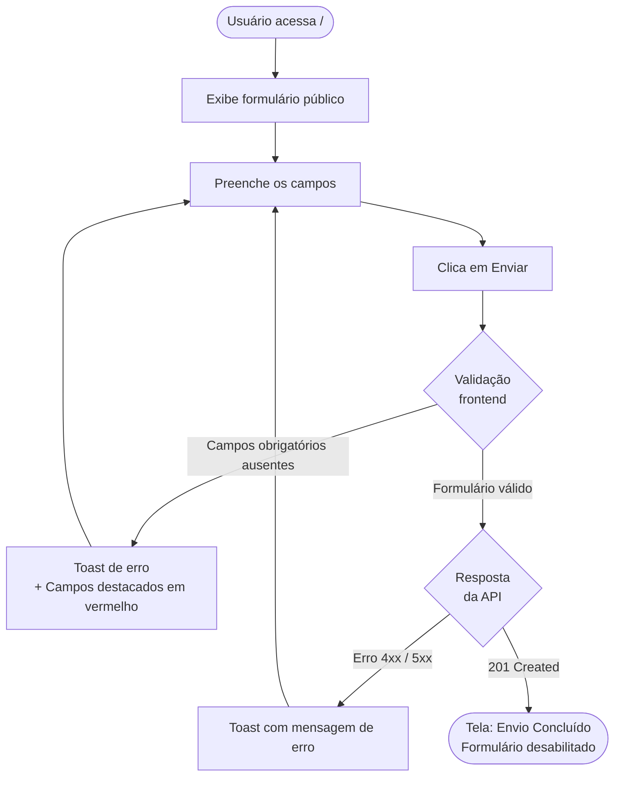
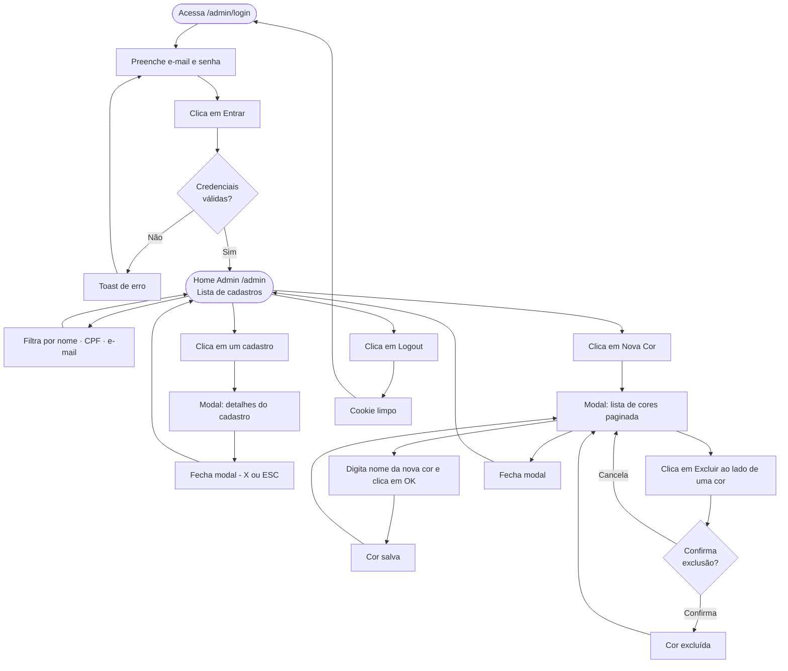

# Especificação Técnica de Requisitos (PRD)

Este documento descreve os requisitos funcionais, não funcionais e a arquitetura técnica para a implementação do sistema de cadastro de clientes, baseado na solicitação direta do cliente.

---

## 1. Pedido do Cliente

> Eu gostaria de uma tela/formulário onde eu possa cadastrar algumas informações dos meus clientes e armazená-las em um banco de dados. Conversei com o meu primo Jorge, ele também é programador. Ele me disse que o Postgres é um banco de dados robusto para esse tipo de trabalho.
> As informações que eu preciso coletar são: Nome completo, CPF, e-mail, cor preferida (entre as cores disponíveis em um arco-íris, isso pode mudar posteriormente) e observações. Eu sei que isso pode parecer um pouco estranho, mas faz parte do meu negócio 🙂
> Preciso que um cliente consiga preencher o formulário uma única vez e ao clicar em enviar, o mesmo deve saber se o cadastro foi bem sucedido.
> Ah... quase me esqueci, o Jorge disse que vai hospedar isso pra mim. Ele mencionou um tal de Docker, disse que vai subir a "imagem" em um serviço terceirizado.
> Eu pretendo continuar esse projeto posteriormente, com outra equipe.

---

## 2. Stack Técnica

| Camada   | Tecnologia              |
| -------- | ----------------------- |
| Frontend | React + TypeScript      |
| Backend  | Nest.js + TypeScript    |
| Banco    | PostgreSQL              |
| ORM      | Prisma                  |
| Auth     | JWT (JSON Web Token)    |
| Infra    | Docker / Docker Compose |

---

## 3. Requisitos Funcionais

### 3.1 Frontend

#### Tela de Formulário Público (`/`)

Acessível sem autenticação. Permite que um cliente realize seu próprio cadastro.

| Campo         | Tipo      | Validação                                           |
| ------------- | --------- | --------------------------------------------------- |
| Nome completo | text      | Obrigatório, mínimo 3 caracteres                    |
| CPF           | text/mask | Obrigatório, formato válido (XXX.XXX.XXX-XX), único |
| E-mail        | email     | Obrigatório, formato válido, único                  |
| Cor preferida | select    | Obrigatório, valores vindos da API (`GET /colors`)  |
| Observações   | textarea  | Opcional                                            |

- Campos obrigatórios não preenchidos devem ser destacados em vermelho com um toast de erro indicando o que está faltando.
- Erros retornados pela API (ex.: CPF ou e-mail já cadastrado) devem ser exibidos via toast.
- Após envio bem-sucedido (`201`), exibir tela de "Envio Concluído" e desabilitar o formulário para evitar reenvio.

#### Tela de Login Administrativo (`/admin/login`)

Acesso restrito ao administrador do sistema.

| Campo  | Tipo     | Validação   |
| ------ | -------- | ----------- |
| E-mail | email    | Obrigatório |
| Senha  | password | Obrigatório |

- Autenticação via JWT. Token armazenado em cookie `httpOnly`.
- Redirecionar para `/admin` após login bem-sucedido.

#### Tela Home Administrativa (`/admin`)

Requer autenticação. Painel de gerenciamento dos cadastros recebidos.

- **Campo de busca:** filtra a lista de cadastros por nome, CPF ou e-mail.
- **Lista de cadastros:** exibe os formulários enviados com, no mínimo, nome, e-mail e cor preferida. Ao clicar em um cadastro, abre modal com todos os detalhes do formulário. Fechar com o botão X ou tecla ESC.
- **Botão "Nova Cor":** abre modal com a lista paginada de cores já cadastradas. Cada cor possui um botão de exclusão (requer confirmação antes de excluir). O modal também permite cadastrar uma nova cor pelo nome.
- **Logout:** encerra a sessão, limpa o cookie e redireciona para `/admin/login`.

---

### 3.2 Backend

#### Customers (`/customers`)

- `POST /customers` — recebe e persiste os dados do formulário público. Retorna `201` em sucesso ou erro de validação/conflito.
- `GET /customers` — lista todos os cadastros. Aceita query params para busca (`?search=`). Rota protegida (JWT).
- `GET /customers/:id` — retorna os detalhes completos de um cadastro específico. Rota protegida (JWT).

#### Colors (`/colors`)

- `GET /colors` — retorna a lista de cores disponíveis. Aceita query params de paginação (`?page=&limit=`). Rota pública.
- `POST /colors` — cadastra uma nova cor. Rota protegida (JWT).
- `DELETE /colors/:id` — remove uma cor. Rota protegida (JWT). Retorna `409` se houver clientes associados à cor.

#### Auth (`/auth`)

- `POST /auth/login` — valida credenciais e retorna JWT via cookie `httpOnly`. Retorna `401` em caso de credenciais inválidas.
- `POST /auth/logout` — limpa o cookie de autenticação. Rota protegida (JWT).

#### Health (`/health`)

- `GET /health` — retorna `200 OK`. Utilizado para liveness check do container.

---

## 4. Requisitos Não Funcionais

- **Validação:** validação de entrada tanto no frontend (UX) quanto no backend (segurança).
- **CPF único:** o sistema deve rejeitar cadastros com CPF já existente (`409 Conflict`).
- **E-mail único:** o sistema deve rejeitar cadastros com e-mail já existente (`409 Conflict`).
- **Containerização:** a aplicação deve ter `Dockerfile` para cada serviço e um `docker-compose.yml` na raiz do repositório, subindo frontend, backend e banco de dados.
- **Manutenibilidade:** código em TypeScript estrito, estrutura de pastas clara, facilitando a continuidade por outra equipe.
- **CORS:** o backend deve aceitar requisições apenas da origem do frontend configurada via variável de ambiente.

---

## 5. Fluxos de Interação

### 5.1 Formulário Público (Usuário)

### 5.2 Painel Administrativo

---

## 6. Referência Visual

O modelo abaixo ilustra o layout esperado das telas do frontend. É apenas uma referência de estrutura e fluxo, não uma especificação visual final.

